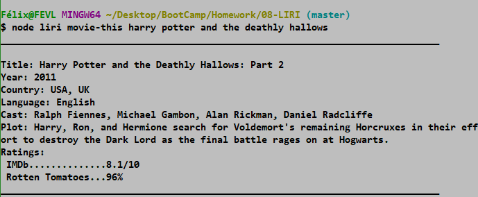
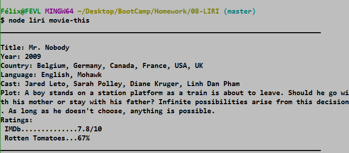
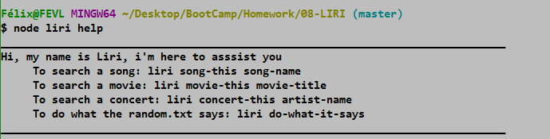

## LIRI
***
## Description  
LIRI is a Language Interpretation and Recognition Interface CLI app
***

## Libraries
   * [Axios](https://www.npmjs.com/package/axios)
   * [Moment](https://www.npmjs.com/package/moment)
   * [DotEnv](https://www.npmjs.com/package/dotenv) 
   * [OMDB API](http://www.omdbapi.com) 
   * [Bands In Town API](http://www.artists.bandsintown.com/bandsintown-api)
   * [Node-Spotify-API](https://www.npmjs.com/package/node-spotify-api)

***
## Notes
* You would need to provide your own .env file with the API keys the format is as follows: 
   SPOTIFY_ID      = xxxxxxxxxxxxxxxxxxxxxxxx   
   SPOTIFY_SECRET  = xxxxxxxxxxxxxxxxxxxxxxxx   
   BandsInTown_ID  = xxxxxxxxxxxxxxxxxxxxxxxx   
   OMDB_API        = xxxxxxxxxxxxxxxxxxxxxxxx   

* There are multiple commands that can be used:
  *  **liri song-this song-name**
   > 
   >  
  *  **liri concert-this artist-name** 
   >      
  *  **liri movie-this movie-title**
   >  
   >  
  *  **liri do-what-it-says**
   >  
* The "do-what-it-says" command requires a random.txt file with the following format:
  *  **command, query**
   >  
* There is a help command inside LIRI, was type liri help.
   >  
***

